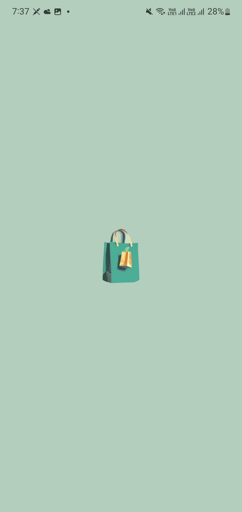
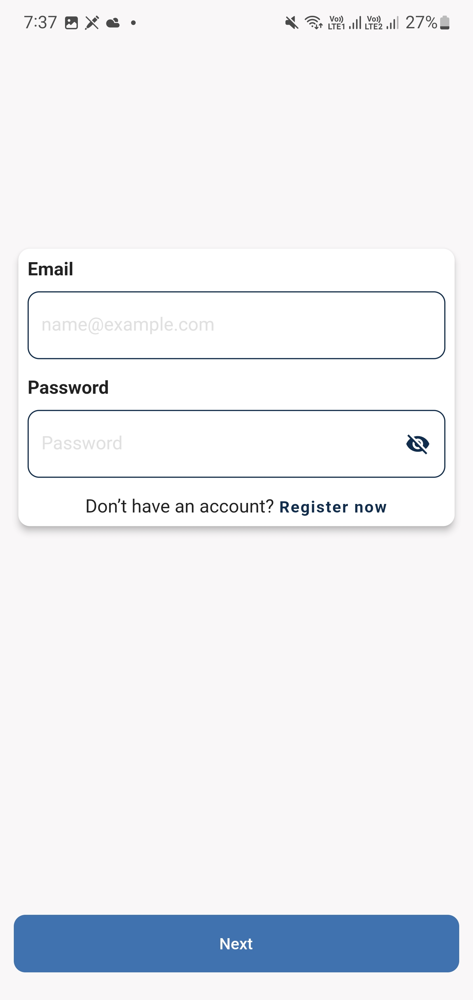
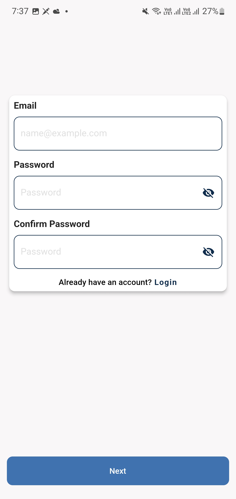
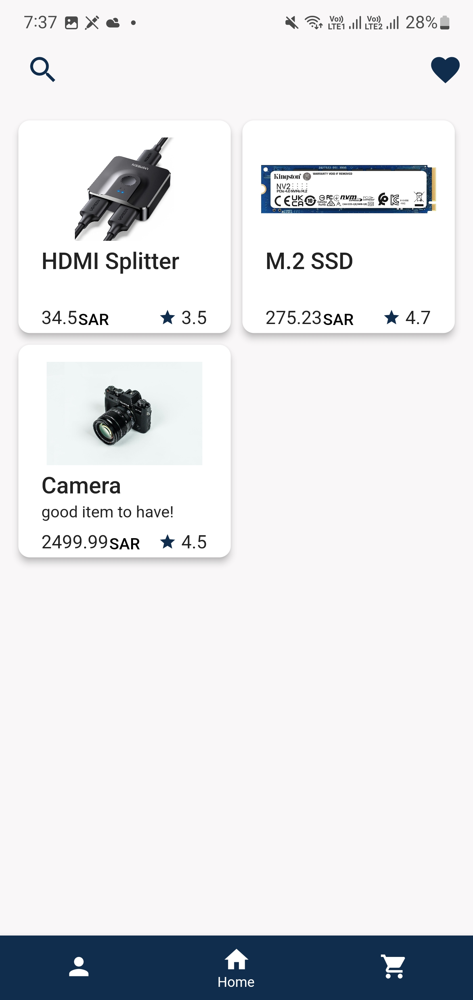
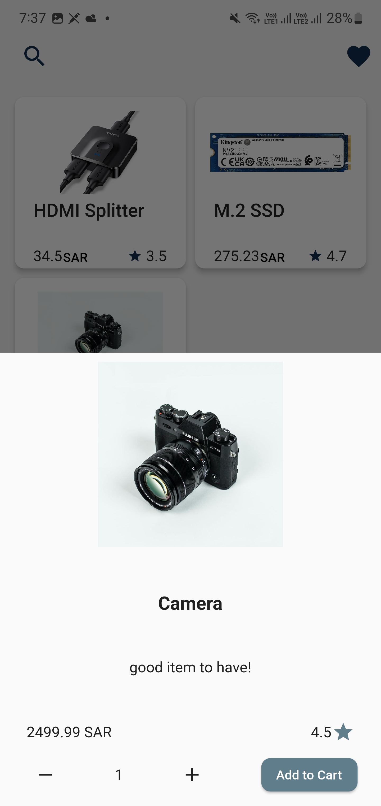
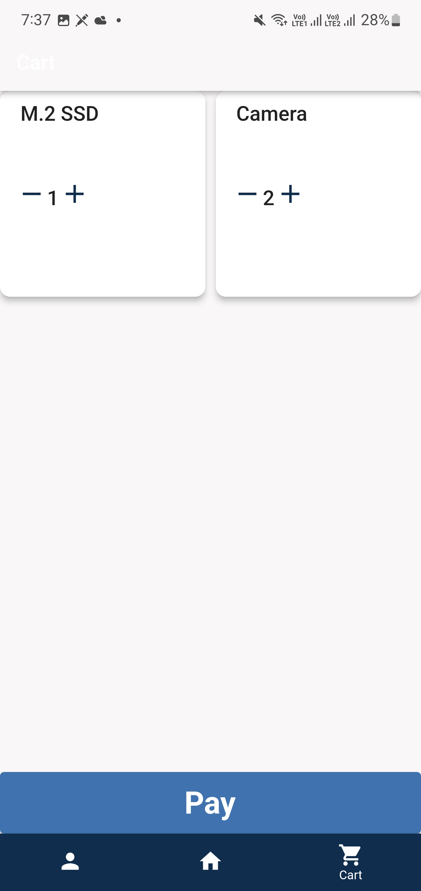

<h1 align="center">
  
  <br>
  Khobar Shopper
</h1>

Khobar Shopper is a Flutter app build as a project for the Secure Software Engineering course at KFUPM.

## Table of Contents

- [Introduction](#introduction)
- [Features](#features)
- [Designs](#designs)
- [Usage](#usage)
- [Team](#team)

## Introduction

The app is an online shopping app where users can view and buy products. There are two types of users: customers and admins. Customers can view all products, add products to their cart, and purchase them. Admins can add new products, and view all orders.

## Features

- [x] User authentication
- [x] Add products to cart
- [x] Purchase products
- [x] Add new products
- [x] View all orders

## Designs

> Feel free to view the initial designs in [Figma](https://www.figma.com/file/9xO29GYE7uN7V5HlAcHvpH/Untitled?type=design&node-id=0%3A1&t=yPV1PobX8iz3320E-1)

<table>
  <tr>
    <td>
      <figure>
        
        <figcaption align="center">
          Fig.1 - Splash Screen
        </figcaption>
      </figure>
    </td>
    <td>
      <figure>
        
        <figcaption align="center">
          Fig.2 - Login Page
        </figcaption>
      </figure>
    </td>
    <td>
      <figure>
        
        <figcaption align="center">
          Fig.3 - Register Page
        </figcaption>
      </figure>
    </td>
  </tr>
  <tr>
    <td>
      <figure>
        
        <figcaption align="center">
          Fig.4 - Home Screen
        </figcaption>
      </figure>
    </td>
    <td>
      <figure>
        
        <figcaption align="center">
          Fig.5 - Review Item Widget
        </figcaption>
      </figure>
    </td>
    <td>
      <figure>
        
        <figcaption align="center">
          Fig.6 - Cart Screen
        </figcaption>
      </figure>
    </td>
  </tr>
</table>

## Usage

### Installation

To run the app, clone the repository to your local machine

```bash
git clone https://github.com/Faisalalali/khobar-shopper
```

Then, run the following command to install the required packages

```bash
flutter pub get
```

Finally, run the app using the following command

```bash
flutter run
```

# Team

| <a href="https://www.linkedin.com/in/faisalalali/" target="_blank">**Faisal Alali**</a> | <a href="https://www.linkedin.com/in/sultan-alkhubayzi-759132229/" target="_blank">**Sultan Alkhubayzi**</a> | <a href="https://www.linkedin.com/in/aditya-salin-babu-706566234/" target="_blank">**Aditya Babu**</a> | <a href="https://www.linkedin.com/in/mubashir542/" target="_blank">**Mubashir Ahmed**</a> | <a href="#" target="_blank">**Ali Yousef**</a> |
| :-------------------------------------------------------------------------------------: | :----------------------------------------------------------------------------------------------------------: | :----------------------------------------------------------------------------------------------------: | :---------------------------------------------------------------------------------------: | :--------------------------------------------: |
|                      |                                            |                                  |                                                                  |                       |
|       <a href="https://github.com/FaisalAlali" target="_blank">`FaisalAlali`</a>        |                   <a href="https://github.com/Sultan-dev" target="_blank">`Sultan-dev`</a>                   |            <a href="https://github.com/SoftwareGeek12" target="_blank">`SoftwareGeek12`</a>            |                            <a href="#" target="_blank">`-`</a>                            |      <a href="https://github.com/AliAlYousef70" target="_blank">`AliAlYousef70`</a>       |
